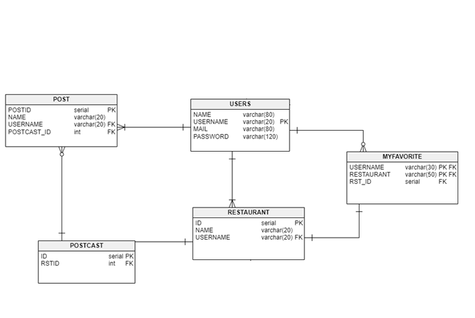
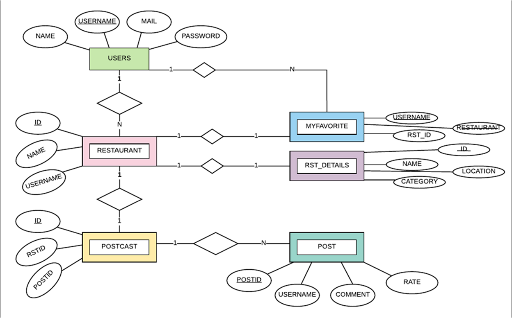
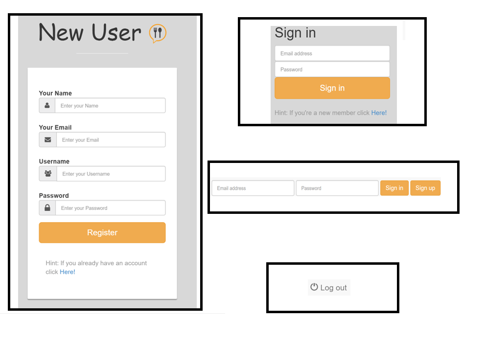

Parts Implemented by Lina Alrehaili
================================

The tables of the database which was implemented by Lina Alrehaili

     *The tables which was implemented by Lina Alrehaili*

The E/R diagram of the above tables

     *E/R diagram of the tables implemented by Lina Alrehaili*
     
Login Management System
-----------------------
For the login part, i have used **flask_login** packages.

.. code-block:: python

   from flask_login import LoginManager
   from flask_login.utils import login_required, login_user, current_user, logout_user

login_required This property should return True if the user is authenticated.
login_user Once a user has authenticated, you log them in with the login_user function.
logout_user Logs a user out.
current_user you can access the logged-in user with the current_user proxy.

     *Login and logout forms*
     
USERS TABLE
-----------
The USERS table stores the informations of the users such as their name, username, mail, password.

.. code-block:: sql

   CREATE TABLE USERS (
                    NAME VARCHAR(80) NOT NULL,
                    USERNAME VARCHAR(20) PRIMARY KEY,
                    MAIL VARCHAR(80) NOT NULL UNIQUE,
                    PASSWORD VARCHAR(120) NOT NULL)

To connect the database with the login system, I have used a user class as shown below. 

.. code-block:: python

   class User(UserMixin):
       def __init__(self, name, userName, eMail, password):

        self.name = name
        self.userName = userName
        self.email    = eMail
        self.password = password
        self.active = True
        self.is_admin = False
    
     def get_id(self):
        return self.userName
    @property
    def is_active(self):
        return self.active

In the **signup page**, a new user is created and their information is added to the USERS table, later on you can use this e-mail and password to login successfully. 
The query below shows it.

.. code-block:: sql

   INSERT INTO USERS (NAME, USERNAME, MAIL, PASSWORD) VALUES (%s, %s, %s, %s)
   
I have used SELECT operation for the USERS table in the **Mainpage** to show the name of the user shown below.

.. code-block:: sql

   SELECT * FROM USERS
   
After selecting the users table, in the mainpage.html we see that if current_user.userName is the same as the username in the USERS table, then print the name of the user.

.. code-block:: html
 
   
          	

		
     <h1 class="title">Welcome back, {{u[0]}}</h1>
			

			
			 
 
RESTAURANT TABLE
-----------------

The RESTAURANT table stores the restaurant name and the username for the user who have added this restaurant, also the name of the restaurant has to be unique as shown in table below.

.. code-block:: sql

   CREATE TABLE RESTAURANT (
                    ID SERIAL PRIMARY KEY,
                    NAME VARCHAR(20) NOT NULL,
                    USERNAME VARCHAR(20) REFERENCES USERS(USERNAME) ON DELETE CASCADE,
                    UNIQUE(NAME) )

I have used insertion and selection operations in the **Mainpage** to add a new restaurant and list it in this page as shown below.

.. code-block:: sql

   INSERT INTO RESTAURANT(NAME, USERNAME) VALUES(%s, %s)
   SELECT * FROM RESTAURANT"
   
Below in the mainpage.html it shows all the restaurants in the table printed the names as a link to **restaurant_page** 
 
.. code-block:: html
 
   
          	
				<a href="{{url_for('site.restaurant_page', rst_id = name[0] )}}" class="" style= "font-size: 15px">
	         		<li>{{name[1]}}</li>
	       		</a>
					
					
          
I have used delete operation on the **restaurant_page** to delete a restaurant, also select operation to print the name of the restaurant where the id for both is the id of the restaurant chosen as shown below.

.. code-block:: sql

   DELETE FROM RESTAURANT WHERE ID = %s
   SELECT * FROM RESTAURANT WHERE ID = %s
   
at restaurant_page.html below is the given code to print the name of the restaurant.

.. code-block:: html

   
			
		<h1 >{{name[1]}}  Restaurant</h1>

	 
  	
   
In the **edit_restaurant page** I have used the select operation to print the name of the restaurant as mentioned before.

RST_DETAILS TABLE
-----------------
To have full informatoin about this table you can see it in jilan's part, but i have used an update operation in this table to update the location and food category of the selected restaurant as shown below.

.. code-block:: sql

   if len(location)!=0 or len(food)!=0 :
            execute=[]
            query="""UPDATE RST_DETAILS SET """
            if len(location)!=0:
                execute+=[str(location)]
                query+="""LOCATION=%s"""
            if len(food)!=0:
                execute+=[str(food)]
                if len(location)!=0:
                    query+=""", """
                query+="""CATEGORY=%s"""

            query+=""" WHERE (ID=%s)"""
            execute+=[rst_id[0]]
            
the code above can let you update one information or both of them.
 
MYFAVOURITE TABLE
------------------

The MYFAVOURITE table stores the username, restaurant name and restaurant id as shown below.

.. code-block:: sql

   CREATE TABLE MYFAVORITE (
                    USERNAME VARCHAR(30) REFERENCES USERS(USERNAME) ON DELETE CASCADE,
                    RESTAURANT VARCHAR(50) REFERENCES RESTAURANT(NAME) ON DELETE CASCADE,
                    RST_ID SERIAL REFERENCES RESTAURANT(ID) ON DELETE CASCADE,
                    PRIMARY KEY(USERNAME,RESTAURANT) )
                    
I used insert operation in the **restaurant page** to add a restaurant to the myfavourite table as shown below.

.. code-block:: sql

   INSERT INTO MYFAVORITE(USERNAME, RESTAURANT,RST_ID) VALUES(%s, %s,%s)
   
on the **favourite page** I used delete and select operation to list the favourite restaurants or delete one as shown below.

.. code-block:: sql

   SELECT * FROM MYFAVORITE
   DELETE FROM MYFAVORITE WHERE (USERNAME= %s and RESTAURANT = %s)
   
POST TABLE
----------
The POST table is for the comments and rate which stores  postid, username, comment and rate as shown below.

.. code-block:: sql

   POSTID SERIAL PRIMARY KEY,
                    USERNAME VARCHAR(20) REFERENCES USERS(USERNAME) ON DELETE CASCADE,
                    COMMENT VARCHAR(500) NOT NULL,
                    RATE VARCHAR(20) DEFAULT 1)
                    
In the **restaurant page** i have used insert operation to insert the feeds to the POST table, also select POSTId from this table to add it to the POSTCAST table which i will explain later, also the last select operation is for printing all the posts for the chosen rastaurant page

.. code-block:: sql

   INSERT INTO POST(USERNAME, COMMENT,RATE) VALUES(%s, %s,%s)
   SELECT POSTID FROM POST WHERE (USERNAME = %s and COMMENT = %s)
   SELECT * FROM POST WHERE POSTID= %s
   
In the **edit_comment page** i have used delete and select operation to delete a comment and to print it in screen as shown below.

.. code-block:: sql

   DELETE FROM POST WHERE (POSTID= %s)
   SELECT * FROM POST WHERE POSTID = %s
   
POSTCAST TABLE
--------------
The POSTCAST table is cast for POST and RESTAURANT tables which stores id, restaurant id and post id as shown below.

.. code-block:: sql

  CREATE TABLE POSTCAST (
                    ID SERIAL PRIMARY KEY,
                    RSTID INTEGER REFERENCES RESTAURANT(ID) ON DELETE CASCADE,
                    POSTID INTEGER REFERENCES POST(POSTID) ON DELETE CASCADE )
                    
 In the **restaurant page**  I have used the insert operation also delete operation after a restaurant is deleted the POSTCAST with the same restaurant is also deleted, also an importent select operation which will select the post id that have the restaurant id of the chosen restaurant to print all the posts of this restaurant in this page as shown below.
 
.. code-block:: sql

   INSERT INTO POSTCAST(RSTID, POSTID) VALUES(%s, %s)
   DELETE FROM POSTCAST WHERE RSTID = %s
   SELECT POSTID FROM POSTCAST WHERE RSTID = %s
