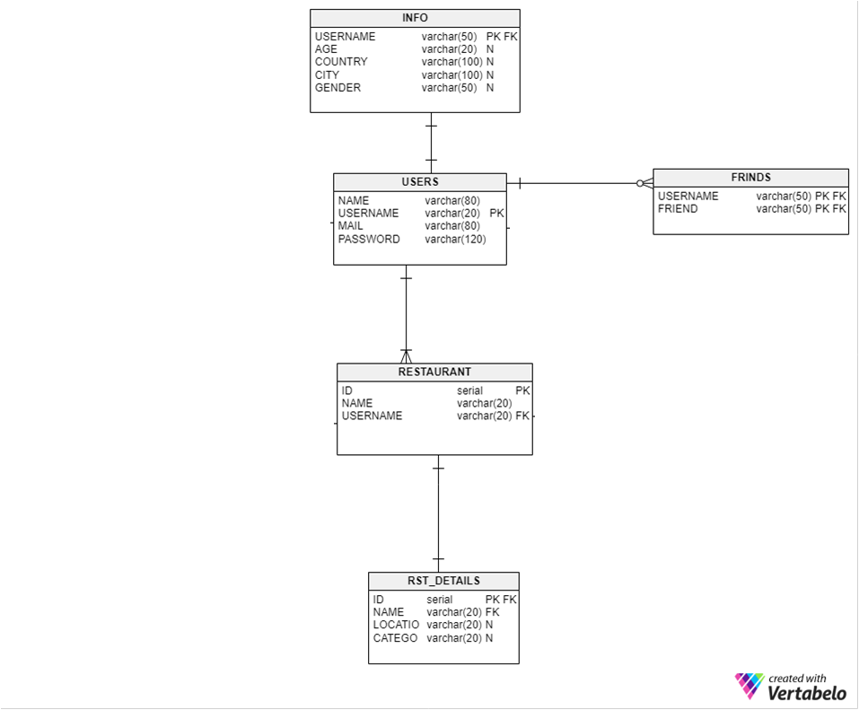
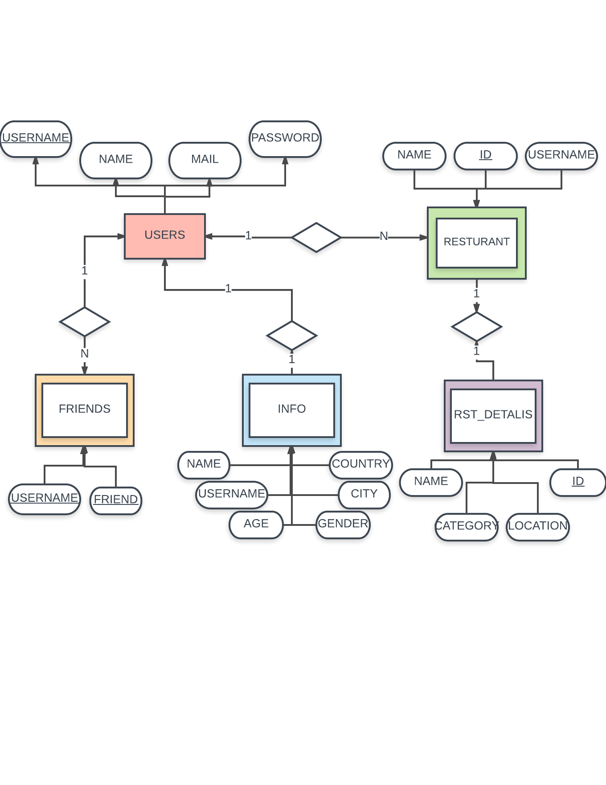

Parts Implemented by jilan alrehaili
====================================

**the tables i have used to create my parts in this project are: [USERS, RESTURANT, RST_DETAILS, INFO, FRIENDS entities]
thses can accomplish all tasks from Deleting and adding a friend, checking and updating user personal profile information (name, surname, age, country, city, gender). deleting user account, changing user email and password, search existing restaurant by name, search nearby restaurants by location.**

the tables of the database which i have used:

     
     
     
the E/R Diagram of the database which i have used:

     

FRIENDS table
-------------

**FRIENDS table** adds/deletes a friend to the users profile. the USERNAME & FRIEND are primary key because each user is kept well distinguished in the process of deleting or adding a friend to the table. both USERNAME & FRIENDS have a maximum of 50 character and this table is connected to the **USERS table**.

                    
 .. code-block:: sql
 
    CREATE TABLE FRIENDS 
    USERNAME VARCHAR(30) REFERENCES USERS(USERNAME) ON DELETE CASCADE,
    FRIEND VARCHAR(50) REFERENCES USERS(USERNAME) ON DELETE CASCADE,
    PRIMARY KEY(USERNAME,FRIEND) )
    
    
if the user choose to update one of his operations the below code will handle this task, he can only do one update at a time as it can be seen below
    
  .. code-block:: sql
 

     friend=request.form['friend']
     if request.form['action'] == 'add':
     query = """INSERT INTO FRIENDS(USERNAME, FRIEND) VALUES(%s, %s)"""
     cursor.execute(query,(current_user.userName, friend))
     connection.commit()
       
     elif request.form['action'] == 'remove':
     query = """DELETE FROM FRIENDS WHERE (USERNAME= %s and FRIEND = %s)"""
     cursor.execute(query,(current_user.userName, friend))
     connection.commit()
     return redirect(url_for('profile_page'))
     
     
the friend that the user typed in, is added to the **FRIENDS table** and into the users profile as seen below.

  .. code-block:: sql
 
     if request.form['action'] == 'add':
     query = """INSERT INTO FRIENDS(USERNAME, FRIEND) VALUES(%s, %s)"""
     cursor.execute(query,(current_user.userName, friend))
     connection.commit()
     
       
the friend that the user typed in, is deleted from the **FRIENDS table** and from the users profile as seen below.

   .. code-block:: sql
 
      elif request.form['action'] == 'remove':
      query = """DELETE FROM FRIENDS WHERE (USERNAME= %s and FRIEND = %s)"""
      cursor.execute(query,(current_user.userName, friend))
      connection.commit()
      return redirect(url_for('profile_page'))
  
  
INFO table
----------

**INFO table** stores all user's information. the table has different necessary varriables like the 'USERNAME', it is both the primary and foreign key in the table and it refers to the **USERS table** primary key, and it has a maximum of 50 characters, other varriable is 'AGE' which has a maximum of 20 characters, the 'COUNTRY' & 'city' has a maximum of 100 characters, the 'GENDER' which has a maximum of 50 characters the name is a maximum of 80 characters
  
                 .. code-block:: sql
                    
                    CREATE TABLE INFO (
                    USERNAME VARCHAR (50) REFERENCES USERS(USERNAME) ON DELETE CASCADE,
                    NAME VARCHAR(80) NULL,
                    AGE VARCHAR(20) NULL,
                    COUNTRY VARCHAR(100)NULL,
                    CITY VARCHAR(100) NULL,
                    GENDER VARCHAR(50) NULL,
                    PRIMARY KEY(USERNAME))
                    cursor.execute(query)

the bellow data is inserted in the table while initializing database.

  .. code-block:: sql
  
     query = """INSERT INTO INFO (USERNAME, SURNAME,AGE,COUNTRY,CITY,GENDER) VALUES ('admin123','alrehaili','30','turkey','istanbul','female')"""
        cursor.execute(query)
            
            
the initial stage of these informations are as defult values. and the user can pick to update all or some of his information only the user by his account can change these personal informations no other user can access this page.

.. code-block:: sql
           
              query = """INSERT INTO INFO (USERNAME, SURNAME, AGE, COUNTRY,CITY,GENDER)
              VALUES ('%s','%s', '%s', '%s', '%s', '%s')""" %(username,'........','........','........','........','........')
             cursor.execute(query)
             connection.commit()

             login_user(user)
            return redirect(url_for('site.main_page'))

the bellow code makes a form request with the data specified in the values to access the form data.

.. code-block:: sql

   surname=request.form['Surname']
            age=request.form['Age']
            country=request.form['Country']
            city=request.form['City']
            gender=request.form['Gender']
            
            
this instructions checks for columns that has new data to insert into the **INFO table**, and it handles any data that is updated.

             .. code-block:: sql

                if len(surname)!=0 or len(age)!=0 or len(country)!=0 or len(city)!=0 or len(gender)!=0:
                execute=[]
                query="""UPDATE INFO SET """
                if len(surname)!=0:
                execute+=[str(surname)]
                query+="""SURNAME=%s"""
                if len(age)!=0:
                execute+=[str(age)]
                if len(surname)!=0:
                query+=""", """
                query+="""AGE=%s"""
                if len(country)!=0:
                execute+=[str(country)]
                if len(surname)!=0 or len(age)!=0:
                query+=""", """
                query+="""COUNTRY=%s"""
                if len(city)!=0:
                execute+=[str(city)]
                if len(surname)!=0 or len(age)!=0 or len(country)!=0:
                query+=""", """
                query+="""CITY=%s"""
                if len(gender)!=0:
                execute+=[str(gender)]
                if len(surname)!=0 or len(age)!=0 or len(country)!=0 or len(city)!=0:
                query+=""", """
                query+="""GENDER=%s"""

  
      
RST_DETAILS table
------------------
 
**RESTURANT table** stores the names of the resturants and the usernames of who added the resturant, the 'ID' in the table is the primary key with a serial number, and the 'USERNAME' is the foreign key with a maximum of 20 characters, and the last one is the 'NAME' with a '20' characters as shown bellow. this table is connected to the **RESTURANTS table** which is connected to **USERS table**.

  .. code-block:: sql
  
     CREATE TABLE RST_DETAILS (
                    ID SERIAL REFERENCES RESTAURANT(ID) ON DELETE CASCADE,
                    NAME VARCHAR(20) REFERENCES RESTAURANT(NAME) ON DELETE CASCADE,
                    LOCATION VARCHAR(20) NULL,
                    CATEGORY VARCHAR(20) NULL,
                    PRIMARY KEY(ID) )

the bellow data is inserted in the table while initializing database.

  .. code-block:: sql
  
     query = """INSERT INTO RST_DETAILS ( NAME, LOCATION,CATEGORY ) VALUES ('Burger king', 'Levent','Fast food')"""
        cursor.execute(query)
        query = """INSERT INTO RST_DETAILS ( NAME, LOCATION,CATEGORY ) VALUES ('Mado', 'Taksim','Turkish food')"""
        cursor.execute(query)

the *nearby page* uses the **RST_DETAILS table** to fetch all the information needed in this operation. the 'LOCATION' attribute of the **RST_DETAILS table** is used to distinguish the location of each resturant.

  .. code-block:: sql
  
     def nearby_page():
    if request.method == 'POST':
        with dbapi2.connect(app.config['dsn']) as connection:
            cursor = connection.cursor()
            location = request.form['Location']
            query = """SELECT * FROM RST_DETAILS WHERE LOCATION = %s"""
            cursor.execute(query,[location])
            names = cursor.fetchall()
            connection.commit()
        return render_template("nearby.html",names=names)
    else:
        return render_template("nearby.html")

  
