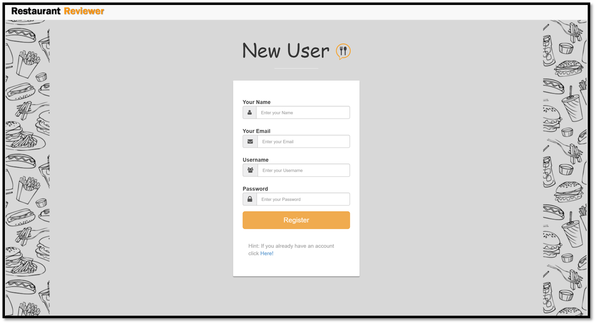
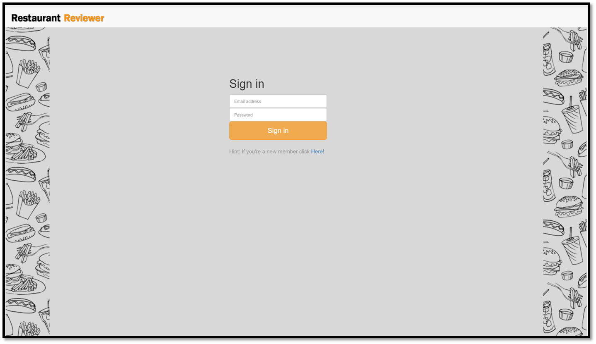
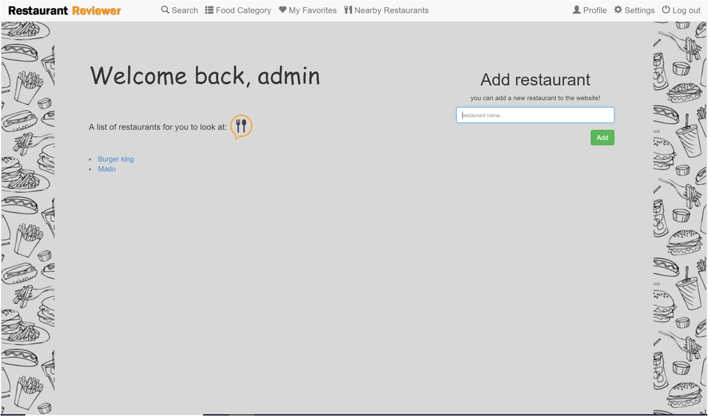
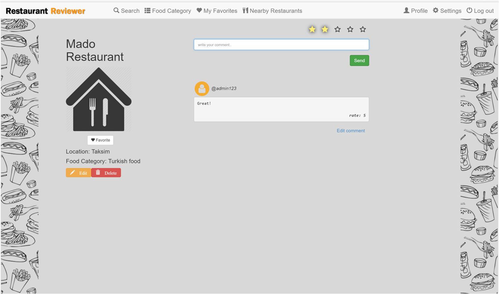
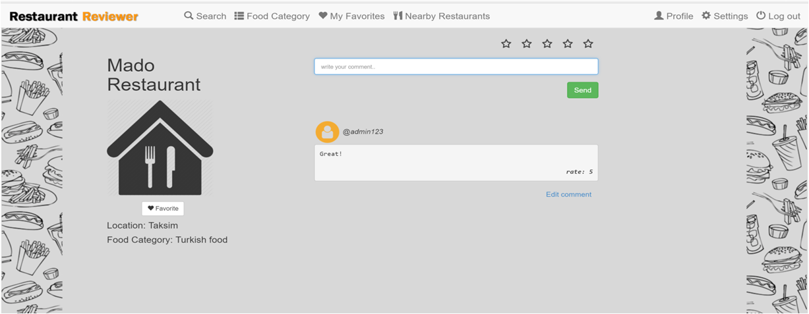
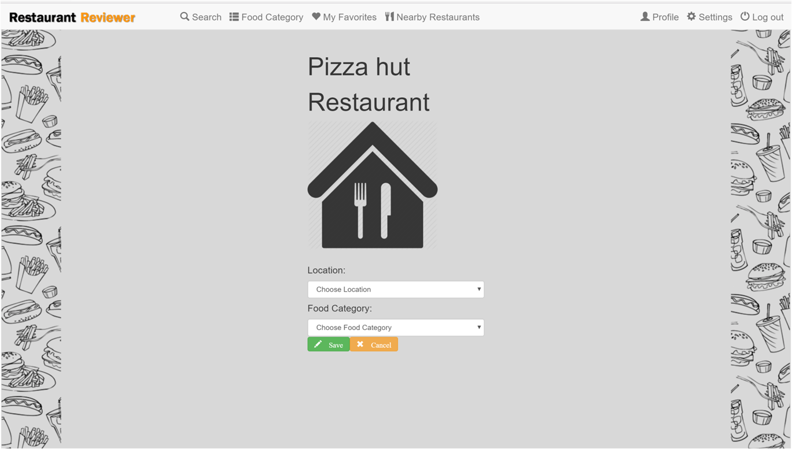
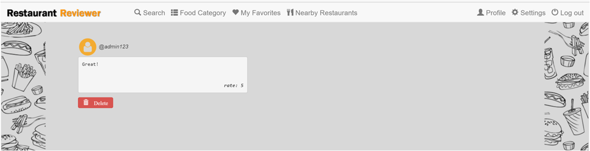
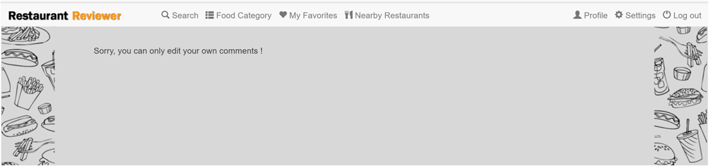
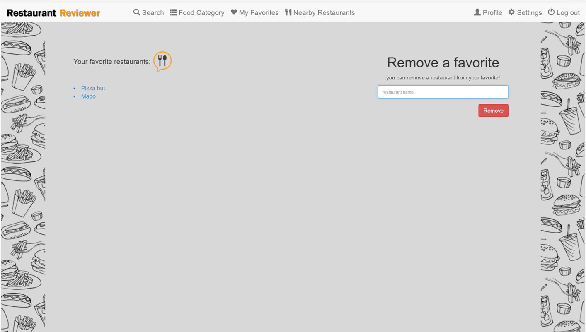
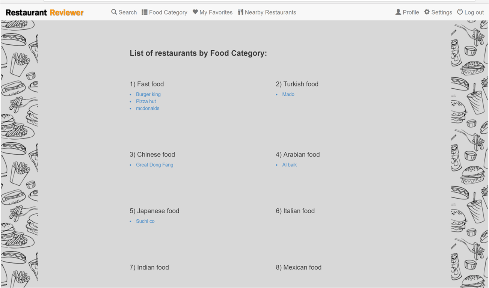

Parts Implemented by Lina Alrehaili
================================

Signup, Signin, Mainpage, Restaurant, MyFavourite and Food Category are pages created by Lina Alrehaili.

Signup Page
-----------
To Signup it is required to fill all the information given in order to register successfully, the email address is unique which means you can't use the same email twise.
The information are kept in the user table which is the main table for this website.
If you already have an account click on 'Here!' to redirect you to the Signin page.

     
     *Signup page for registering to Restaurant Reviewer*

Signin Page
------------
To access the Restaurant Reviewer website, you have to Signin successfully first!  If you try to access a page that requires an authorizatiton without being signed in, the system redirects you to the Signin page.
If you don't have an account click on 'Here!' to redirect you to the Signup page.

          
     *Signin page the redirected page if your not authorized* 
     
Mainpage
---------
After you sign in successfully, this page appear which is the Mainpage, the header of the page includes the name of the user after the sentence 'Welcome Back,' where you can see below the name of the user is 'admin', underneath the sentence you can see all the restaurant as link that where added to this website from any user, you can click on one of the restaurants from the list which will redirect you to the Restaurant Page of the clicked restaurant, on the right side you can add a new restaurant to the website where afterwards it will show on the list of the left side, and the name of the restaurant and the user who added it will be stored in the Restaurant table.

          
     *Mainpage after you sign in* 
     
Restaurant Page
---------------
In this Restaurant page you can add your own comment and rate about the restaurant you've chosen, you can also see other users comments and rates about this restaurant. On the the left side the name of the restaurant is shown which is 'Mado' in this page, any user can add this restaurant to their favourite list, when you add a restaurant, the location and category values are default to 'Not provided', but afterwards you can edit both of them by clicking on the 'Edit' button to redirect you to the edit_restaurant Page, if you didn't add this restaurant then you can't edit it's information' as seen in 'Figure-1'.
Also you can edit comments which will redirect you to edit_comment page.

          
     *Restaurant page if you added this restaurant* 
     

          
     *Figure-1 view of Restaurant page if you didn't add this restaurant* 
      
edit_restaurant Page
-----------------
In this page you can edit both information of location and food category or just edit one of them.
After you finish, you can save your changes or cancel it.

          
     *edit restaurant location and food category*
  
     
edit_comment Page
-----------------
You can edit your own comment and delete as seen in 'Figure-1', but if you edit other users comment then you can't delete it as seen in 'Figure-2'.

          
     *Figure-1 your comment*
     

          
     *Figure-2 not your comment* 
     
favourite Page
---------------
In this page you can see all your favourite restaurants on the left side, you can also remove a restaurant from your favourite by typing the restaurant name on the text box then click remove to delete it from the your favourite list.

          
     *favourite page which shows your favourite restaurants*
     
Food category Page
------------------
In this page you can see the restaurants accordding to their food category.

          
     *Food category Page which shows restaurant accordding to their food category*
