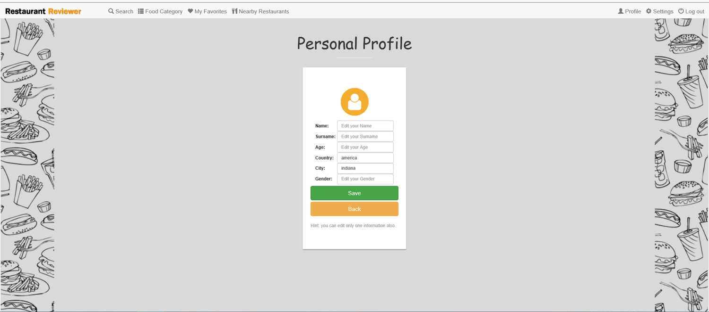

Parts Implemented by jilan alrehaili
====================================

**i have made few pages in this project which i have titled them as: profile page, edit profile page, friend page, nearby page, search page, setting page. and i will show the function of the pages and illustrate all of them in here**

profile page
------------

     
     
     
the user can access his profile page from the navigation bar by clicking on 'profile'. when the user first registers to the website all his personal informations (name, surname, age...) will be set as defult until he decides to update them. the user in this page is free to either edit his personal information or simply just see them or he can even add or delete a friend from his profile page.

     

edit profile page
-----------------

     
     
     
the user can access his edit profile page by clicking on 'edit'. all his informations can be updated at anytime and he can also choose to edit few or all of his information.

     

*edit profile page 1*

     
     
     
the user in this case choice to update two fields the country and the city, lets say he moved out!

     

*edit profile page 2*

     
     
     
the user have clicked 'save' to save his changes, and a message window appeared to show that the changes have been saved in the database and in his profile.

     

*edit profile page 3*

     
     
     
this image shows the updated information.

friend page
------------

.. figure:: images/jilan/friendp.png
     :scale: 100 %
     :alt:  friend page

     
     
     
in this section the user can add a friend to his list or delete a friend, this can be done by typing the username,
only the user can edit this information for everyone to see.

*friend page 1*

     
     
     
after clicking 'add' this user 'admin123' is added to the friend list in his profile 

nearby page
-------------

     
     
     
the user can access nearby page from the navigation bar by clicking on 'nearby resturants'.the user can feel free to search for a resturant by its location, we defined this in a drop-down list where he can see all the resturants in the locations.

*nearby page 1*

.. figure:: images/jilan/nearbyp1.png
     :scale: 100 %
     :alt:  nearby page

     
     
     
the user decided to search at this location!

*nearby page 2*

     
     
the user here picked a location and 'Burger king' resturant appeared in that location.

search page 
-------------

     
     
the user can access search page from the navigation bar by clicking on 'search'.this website has another feature which allows the user to search for resturants by its name.

*search page 1*

     
     
the user decided to search for 'Burger king' resturant.

*search page 2

     
     
after clicking on the resturant link it takes you to the resturant's page.

setting page 
-------------

     
     
the user can access his settting page from the navigation bar by clicking on 'settings'. he is free to change his email and his password, after he puts his prefered updates he can click 'save'. if he decided to delete his account all his information from comments to friends list will be deleted from the database.
